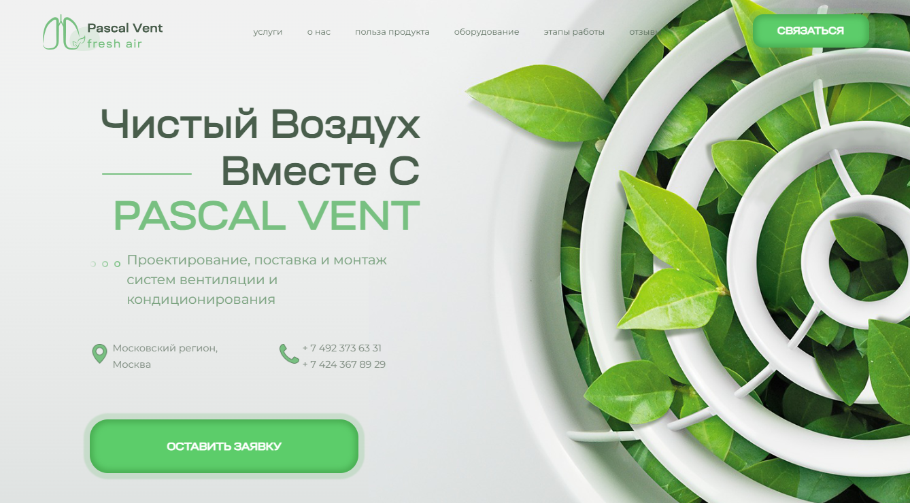

# Проект Pascal Vent

## Введение

Данный сайт является лендингом для компании Pascal Vent (не существующая компания).
За основу был взять макет [Figma](https://www.figma.com/file/RnYKlNVTRDYqseHoV8mhUh/Pascal-Vent?type=design&t=fm66IWJNEN2Q0HLn-6).
Сайт поддерживает как ПК так и мобильные устройства за счет реализации адаптивной верстки.

Реализация основанна на JS Vanila  и HTML CSS
 соответственно.

To create the React app, I'll be using [`create-react-app`](https://create-react-app.dev/), which is a tool people can use to create a React app from scratch. To deploy the React app, I'll be using [`gh-pages`](https://github.com/tschaub/gh-pages), which is an npm package people can use to deploy things to [GitHub Pages](https://docs.github.com/en/pages/getting-started-with-github-pages/about-github-pages), a free web hosting service provided by GitHub.

If you follow along with this tutorial, you'll end up with a new React app—hosted on GitHub Pages—which you can then customize.

## API
Для реализации некоторых особенностей были использованны сторонние API.

1. [Swiper](https://swiperjs.com/).

   > Для реализации Swipe меню. Первое меню поддерживает переключени с помощью стрелок на клавиатуре, когда блок находится в видемости окна просмотра. Второе меню данной особенности > не имеет. 
   > Смена блоков возможна как с помощью кнопок переключения, так и с помощь "свайпов".

2. [Google Form](https://github.com/jsdevel/google-form).

   > API использует Google Form для сбора данных из форм на сайте. Данные передаюся в таблицу на основе  [Google Sheets](https://docs.google.com/spreadsheets/d/1hA40SR9eXGamHbe_n4P9q4QEqJ-z5hhuEUyY-tPwWN8/edit?usp=sharing).

   > ### ВНИМАНИЕ!
   > [Ссылка](https://docs.google.com/spreadsheets/d/1hA40SR9eXGamHbe_n4P9q4QEqJ-z5hhuEUyY-tPwWN8/edit?usp=sharing) на таблицу рабочая.
   > Предоставлено право доступа только на чтение. Поэтому особо важно не использовать реальные персональные данные для проверки работоспособности данной функции.
   > 
   > Данный способ сбора информации был выбрал для реализации с использование GH-Pages, или иным ресурсам без поддержки PHP или наличия back-end'а.

## Ссылка на проект

   [Ссылка на gt-pages](https://kiars1.github.io/Pascal-Vent).
   

### Развитие проекта

    В дальнейшем планируется:
    1. Рефакторинг кода, для уменьшения количества файлов.
    2. Реализация добавления фото-эелементов с помощью "template". Для удобного обновления информации.